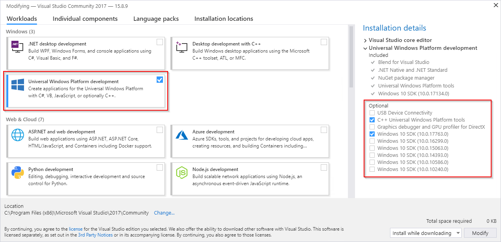

# Calculator
The Windows Calculator app is a modern Windows app written in C++ and C# that ships pre-installed with Windows.
The app provides standard, scientific, and programmer calculator functionality, as well as a set of converters between various units of measurement and currencies.

Calculator ships regularly with new features and bug fixes. You can get the latest version of Calculator in the [Microsoft Store](https://www.microsoft.com/store/apps/9WZDNCRFHVN5).

[](https://github.com/microsoft/calculator/actions/workflows/action-ci.yml)


## Features
- Standard Calculator functionality which offers basic operations and evaluates commands immediately as they are entered.
- Scientific Calculator functionality which offers expanded operations and evaluates commands using order of operations.
- Programmer Calculator functionality which offers common mathematical operations for developers including conversion between common bases.
- Date Calculation functionality which offers the difference between two dates, as well as the ability to add/subtract years, months and/or days to/from a given input date.
- Calculation history and memory capabilities.
- Conversion between many units of measurement.
- Currency conversion based on data retrieved from [Bing](https://www.bing.com).
- [Infinite precision](https://en.wikipedia.org/wiki/Arbitrary-precision_arithmetic) for basic
  arithmetic operations (addition, subtraction, multiplication, division) so that calculations
  never lose precision.

## Getting started
Prerequisites:
- Your computer must be running Windows 11, build 22000 or newer.
- Install the latest version of [Visual Studio](https://developer.microsoft.com/en-us/windows/downloads) (the free community edition is sufficient).
  - Install the "Universal Windows Platform Development" workload.
  - Install the optional "C++ Universal Windows Platform tools" component.
  - Install the latest Windows 11 SDK.

  
- Install the [XAML Styler](https://marketplace.visualstudio.com/items?itemName=TeamXavalon.XAMLStyler) Visual Studio extension.

- Get the code:
    ```
    git clone https://github.com/Microsoft/calculator.git
    ```

- Open [src\Calculator.sln](/src/Calculator.sln) in Visual Studio to build and run the Calculator app.
- For a general description of the Calculator project architecture see [ApplicationArchitecture.md](docs/ApplicationArchitecture.md).
- To run the UI Tests, you need to make sure that
  [Windows Application Driver (WinAppDriver)](https://github.com/microsoft/WinAppDriver/releases/latest)
  is installed.

## Standalone web version

This repository also contains a standalone browser version at `index.html`.

The web implementation is intended to replace the native Windows front end over time, so the web
shell is now being driven toward visual and behavioral parity with the Windows Calculator layouts
exposed by `MainPage.xaml`:

| Windows mode | Standalone web version |
| --- | --- |
| Standard | ✅ |
| Scientific | ✅ |
| Programmer | ✅ |
| Date Calculation | ✅ |
| Unit Converter | ✅ |
| Graphing | ✅ |
| History and Memory | ✅ |

The native Windows app remains the source of truth for the original UWP architecture, infinite
precision engine, and existing Windows behavior. The standalone web version now targets parity in:

- shell chrome, navigation, display proportions, memory row, keypad sizing, and side panels
- adaptive behavior across phone-width, tablet-width, and desktop-width layouts
- keyboard handling, history/memory affordances, and other user-facing calculator interactions

See [docs/StandaloneWebParity.md](docs/StandaloneWebParity.md) for the replacement checklist,
golden viewport sizes, rollout phases, and Windows packaging guidance.

### Run the standalone web version

```bash
npm install
npm start
```

Then open `http://127.0.0.1:4173/index.html`.

### Install as a PWA

Run the standalone web version over `http://127.0.0.1:4173` or another secure-origin deployment and use the browser install prompt to add it as an app.

The web app now ships with a manifest, install icons, and a service worker that caches the standalone shell for repeat launches and offline use.

### Validate the standalone web version

```bash
npm run check
```

When validating UI parity changes, compare the standalone web app against the Windows reference
captures for the same mode and viewport size. The first parity pass uses this reference shell
image: `https://github.com/user-attachments/assets/c2b6f86f-fa8f-4b05-995c-3e629f9744bd`

### Standalone web structure

The standalone web app is now split into multiple focused files so it more closely mirrors the
Windows project organization by feature area instead of keeping everything in a single script and
stylesheet.

#### JavaScript

- `web/scripts/app.js` — startup and event wiring
- `web/scripts/config.js` — mode metadata, button maps, unit definitions
- `web/scripts/state.js` — app state creation and persistence
- `web/scripts/logic.js` — calculator, converter, date, graphing, and shared mode logic
- `web/scripts/utils.js` — shared formatting helpers
- `web/scripts/Views/MainPage.js` — interior shell composition matching the native `MainPage.xaml` role
- `web/scripts/Views/Calculator.js` — standard/scientific/programmer surface rendering matching `Calculator.xaml`
- `web/scripts/Views/CalculatorScientificAngleButtons.js` — scientific header controls matching `CalculatorScientificAngleButtons.xaml`
- `web/scripts/Views/CalculatorProgrammerDisplayPanel.js` — programmer header controls matching `CalculatorProgrammerDisplayPanel.xaml`
- `web/scripts/Views/CalculatorProgrammerBitFlipPanel.js` — programmer bit-flip surface matching `CalculatorProgrammerBitFlipPanel.xaml`
- `web/scripts/Views/HistoryList.js` — history panel rendering matching `HistoryList.xaml`
- `web/scripts/Views/Memory.js` — memory panel and toolbar rendering matching `Memory.xaml`
- `web/scripts/Views/DateCalculator.js` — date mode rendering matching `DateCalculator.xaml`
- `web/scripts/Views/UnitConverter.js` — converter rendering matching `UnitConverter.xaml`
- `web/scripts/Views/GraphingCalculator/GraphingCalculator.js` — graphing surface rendering matching `GraphingCalculator.xaml`

#### CSS

- `web/styles/theme.css` — tokens and global element styles
- `web/styles/Views/MainPage.css` — shell, navigation, and shared layout aligned to `MainPage.xaml`
- `web/styles/Views/Calculator.css` — calculator surfaces and shared calculator cards aligned to `Calculator.xaml`
- `web/styles/Views/CalculatorScientificAngleButtons.css` — scientific header control styling aligned to `CalculatorScientificAngleButtons.xaml`
- `web/styles/Views/CalculatorProgrammerDisplayPanel.css` — programmer display control styling aligned to `CalculatorProgrammerDisplayPanel.xaml`
- `web/styles/Views/CalculatorProgrammerBitFlipPanel.css` — programmer bit-flip grid styling aligned to `CalculatorProgrammerBitFlipPanel.xaml`
- `web/styles/Views/HistoryList.css` — history list styling aligned to `HistoryList.xaml`
- `web/styles/Views/Memory.css` — memory list styling aligned to `Memory.xaml`
- `web/styles/Views/DateCalculator.css` — date mode layout aligned to `DateCalculator.xaml`
- `web/styles/Views/UnitConverter.css` — converter layout aligned to `UnitConverter.xaml`
- `web/styles/Views/GraphingCalculator/GraphingCalculator.css` — graphing canvas styling aligned to `GraphingCalculator.xaml`
- `web/styles/responsive.css` — adaptive layout rules

### Windows packaging direction

If the goal is to replace the native Windows experience as closely as possible, package the web
front end in a Windows-native host first (for example WebView2/WinUI) so window chrome, scaling,
startup feel, and platform integration stay aligned with the in-box Calculator experience. Electron
remains an option for faster desktop packaging, but it is not the default recommendation for
pixel- and behavior-level Windows parity.

## Contributing
Want to contribute? The team encourages community feedback and contributions. Please follow our [contributing guidelines](CONTRIBUTING.md).

If Calculator is not working properly, please file a report in the [Feedback Hub](https://insider.windows.com/en-us/fb/?contextid=130).
We also welcome [issues submitted on GitHub](https://github.com/Microsoft/calculator/issues).

## Roadmap
For information regarding Windows Calculator plans and release schedule, please see the [Windows Calculator Roadmap](docs/Roadmap.md).

### Graphing Mode
Adding graphing calculator functionality [is on the project roadmap](https://github.com/Microsoft/calculator/issues/338) and we hope that this project can create a great end-user experience around graphing. To that end, the UI from the official in-box Windows Calculator is currently part of this repository, although the proprietary Microsoft-built graphing engine, which also drives graphing in Microsoft Mathematics and OneNote, is not. Community members can still be involved in the creation of the UI, however developer builds will not have graphing functionality due to the use of a [mock implementation of the engine](/src/GraphingImpl/Mocks) built on top of a
[common graphing API](/src/GraphingInterfaces).

## Diagnostic Data
This project collects usage data and sends it to Microsoft to help improve our products and services.
Read our [privacy statement](https://go.microsoft.com/fwlink/?LinkId=521839) to learn more.
Diagnostic data is disabled in development builds by default, and can be enabled with the `SEND_DIAGNOSTICS`
build flag.

## Currency Converter
Windows Calculator includes a currency converter feature that uses mock data in developer builds. The data that
Microsoft uses for the currency converter feature (e.g., in the retail version of the application) is not licensed
for your use. The mock data will be clearly identifiable as it references planets instead of countries,
and remains static regardless of selected inputs.

## Reporting Security Issues
Please refer to [SECURITY.md](./SECURITY.md).

## License
Copyright (c) Microsoft Corporation. All rights reserved.

Licensed under the [MIT License](./LICENSE).
