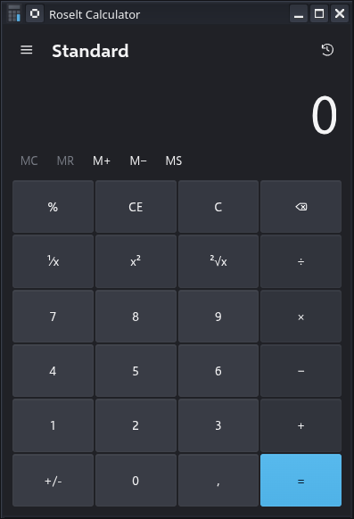

# Calculator

Calculator is a standalone web app that runs entirely in the browser. It includes standard,
scientific, programmer, graphing, date calculation, history/memory, and unit conversion modes in a
single installable interface.



## Features

- Standard, scientific, and programmer calculator modes
- Graphing, date calculation, and unit conversion workflows
- History and memory panes with local persistence
- Keyboard input support across calculator modes
- Installable PWA with offline shell caching
- Responsive layouts for phone, tablet, and desktop widths

## Getting started

Prerequisites:

- Node.js and npm
- Python 3, or another way to serve the repository over HTTP

Install dependencies:

```bash
npm install
```

Start a local server from the repository root:

```bash
npm start
```

Then open `http://127.0.0.1:4173/index.html`.

## Validation

Run the script syntax check before opening a pull request:

```bash
npm run check
```

For manual regression coverage, use [docs/ManualTests.md](docs/ManualTests.md).

## PWA support

The app includes:

- `manifest.json` for installation metadata
- `service-worker.js` for offline shell caching
- icons under `web/assets/`

To test installation behavior, serve the app over `http://127.0.0.1:4173` during development or a
secure origin in production.

## Project structure

### Runtime entry points

- `index.html` boots the browser shell
- `manifest.json` defines install metadata
- `service-worker.js` caches the standalone experience

### JavaScript

- `web/scripts/bootstrap.js` registers the app and service worker
- `web/scripts/app.js` wires startup, events, and top-level rendering
- `web/scripts/config.js` defines modes, buttons, units, and app metadata
- `web/scripts/state.js` manages persisted UI state
- `web/scripts/logic.js` contains calculator, converter, date, and graphing logic
- `web/scripts/Views/` contains mode-specific rendering modules

### CSS

- `web/styles/theme.css` defines tokens and global styles
- `web/styles/Views/` contains view-specific styling
- `web/styles/responsive.css` handles layout changes by viewport size

## Documentation

- [Application architecture](docs/ApplicationArchitecture.md)
- [Manual test plan](docs/ManualTests.md)
- [Feature development process](docs/NewFeatureProcess.md)
- [Roadmap](docs/Roadmap.md)
- [Web quality checklist](docs/StandaloneWebParity.md)

## Contributing

See [CONTRIBUTING.md](CONTRIBUTING.md) for contribution guidance. Use GitHub issues for bug reports
and feature proposals.

## Reporting security issues

See [SECURITY.md](SECURITY.md).

## License

Licensed under the [MIT License](LICENSE).