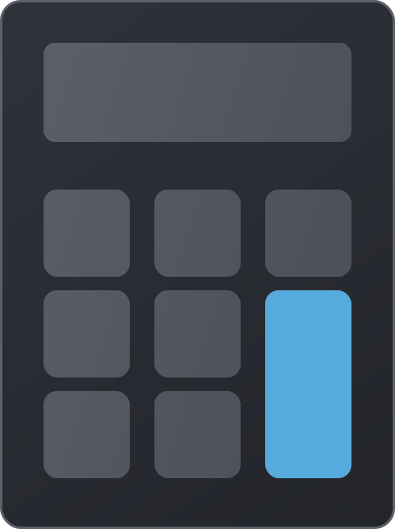

  

<h1 align="center">
  Roselt Calculator
</h1>
<h2 align="center">
  Installable all-in-one calculator app for everyday math, technical work, and quick problem solving.
</h2>

This document tracks release summaries for Roselt Calculator.

Roselt Calculator is built to cover quick everyday calculations, deeper technical workflows, and installable cross-device use in one app.

## Release Notes
* [Version 12.0.0 (10/04/2026)](#version-1200-10042026)
* [Version 1.0.0 (05/04/2026)](#version-100-05042026)

## Version 12.0.0 (10/04/2026)

- Rebranded the project as Roselt Calculator and launched a public-facing website for the installable app.
- Added desktop packaging support with Electron, Flatpak, portable Windows builds, AppImage packaging, and Flathub submission prep.
- Expanded customization with multilingual support, a much larger theme catalog, dedicated theme selection UI, per-theme CSS files, theme preloading, and a live themes showcase page.
- Continued polishing the shipped 12.0.0 experience with responsive layout work, refreshed logos and screenshots, currency localization, and clearer settings organization.

## Version 1.0.0 (05/04/2026)
- Shipped the standalone web calculator foundation with Standard, Scientific, Programmer, and Graphing calculator workflows in one app shell.
- Added converter tooling for currency, unit, and date calculations, along with history and memory improvements across modes.
- Introduced the first settings page, responsive layout tuning, tooltip coverage, Windows-style UI parity work, and Progressive Web App support.
